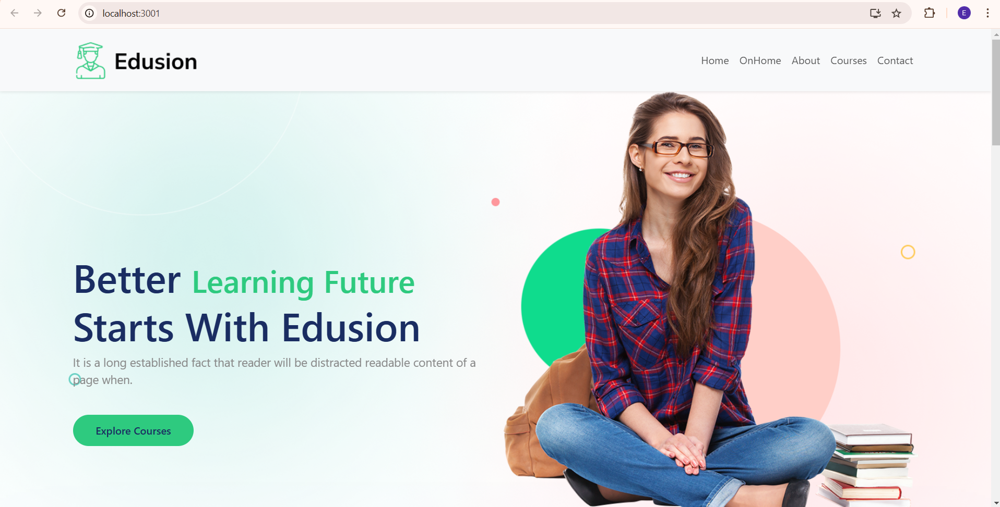
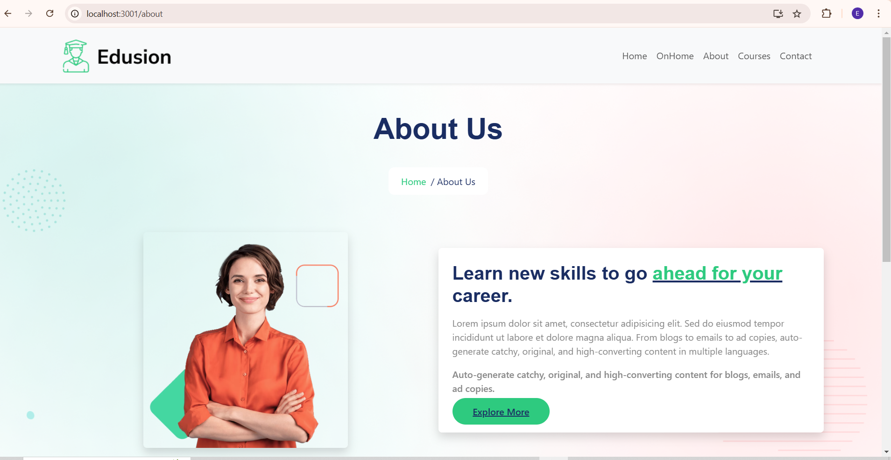

Edusion Learning Platform ( mini  Learning Management System) :- 

A responsive, modern React-based educational website that offers courses, learning resources, and contact management. This project demonstrates the integration of React components, React Router, Bootstrap, and custom CSS for a full-featured e-learning platform.
## Screenshots

### Home Page

### About Page

Features:-

1. Responsive Design: Fully responsive layout compatible with desktop, tablet, and mobile devices.

2. Home Page: Showcases featured content, key offerings, and learning opportunities.

3. OnHome Section: Highlights popular topics and provides a search functionality for courses.

4. Courses Page: Displays a list of courses with category, lessons, duration, rating, level, and price.

5. About Page: Provides information about the platform, its mission, vision, and team.

6. Contact Page: Interactive contact form with location, email, and phone details.

7. Footer: Includes company info, course links, contact information, and social links.

8. Animations: Smooth fade-in effects for sections and content for a modern UX.

Reusable Components: ExploreButton, QualityEducation, ExperiencedTeachers, DeliciousFood.

Project Structure
src/
├─ Assets/Images/       # All image assets
├─ SheredComponent/     # Shared React components like buttons and info cards
├─ Components/          # Main page components (Home, About, Courses, Contact, Footer, NavBar)
├─ App.js               # Main React App component
├─ index.js             # React entry point
├─ CSS/
│  ├─ LMS.css
│  ├─ Home.css
│  ├─ Courses.css
│  ├─ Contact.css
│  ├─ Footer.css
│  └─ ExploreButton.css

Technologies Used:- 
1. React
2. React Router
3. React Bootstrap
4. React Icons
5. Custom CSS
6. Responsive Design with Flexbox and Grid
7. Components Overview
8. NavBar

Components Overview:-
A. NavBar:-
      1. Responsive top navigation with sticky behavior.
      2. Collapsible menu for mobile devices.
      3. Links to Home, OnHome, About, Courses, Contact.
B.Home:-
      1. Hero section with background image, main headline, and call-to-action button.
      2. Sections for QualityEducation, ExperiencedTeachers, and DeliciousFood.
      3. About cards displaying Mission and Vision.
C.OnHome:-
      1. Popular topics section with category cards.
      2. Free courses promotion section.
      3. Search bar for courses.

D.Courses:-
      1. Grid of courses with image, title, category, lessons, duration, rating, level, and price.
      2. Hover effects on course cards.

E.About:-
      1.Informational page with images and text about learning objectives.
      2.Highlights skills to enhance career opportunities.

F.Contact:-
      1.Contact form with name, email, subject, and message fields.
      2.Company location, phone numbers, and email addresses displayed.

G.Footer:-
      1.Divided into sections: Courses, Company, Contact Info.
      2.Footer bottom includes copyright.

H.Styling:-
      1. Custom CSS for responsive layout, animations, and cards.
      2. Reusable button and card components.
      3. Fade-in animations for content on scroll.
